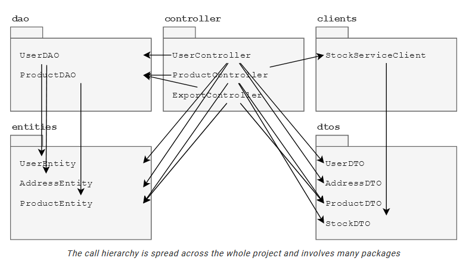
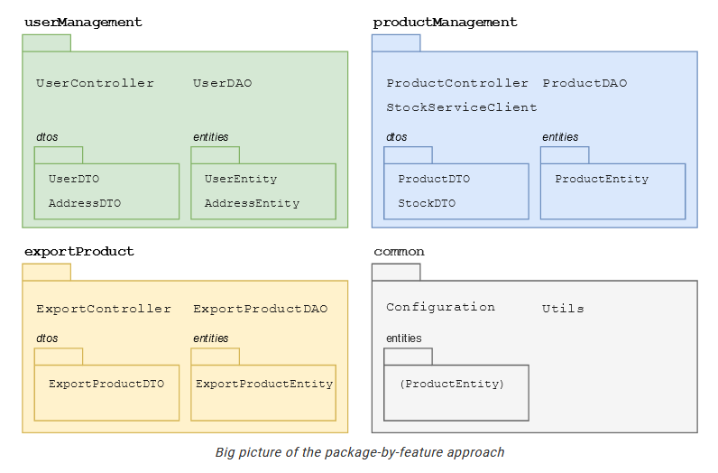
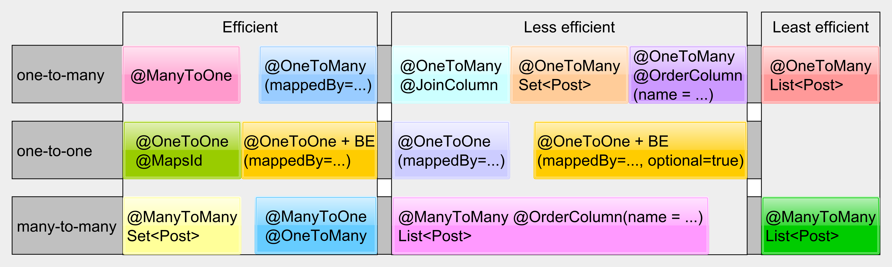

# Table of Content

- [Table of Content](#table-of-content)
- [Goal](#goal)
- [How to launch (TODO)](#how-to-launch-todo)
- [Project Structure](#project-structure)
- [Lombok](#lombok)
    * [Main Arguments](#main-arguments)
    * [Lombok and Entity](#lombok-and-entity)
    * [Lombok and Logger](#lombok-and-logger)
    * [Lombok and IntelliJ](#lombok-and-intellij)
- [Endpoints](#endpoints)
    * [HTTP Methods](#http-methods)
        + [Idempotent Methods](#idempotent-methods)
        + [GET](#get)
        + [POST](#post)
        + [PUT](#put)
        + [PATCH](#patch)
            - [JSON Patch](#json-patch)
            - [JSON Merge Patch](#json-merge-patch)
        + [PATCH vs POST](#patch-vs-post)
- [Error Handling](#error-handling)
- [Repository](#repository)
    * [Use ``getResultList()`` vs ``getSingleResult()``](#use-getresultlist-vs-getsingleresult)
    * [Prefer JPQL versus Criteria builder.](#prefer-jpql-versus-criteria-builder)
    * [TODO Remove scanning of Spring Data](#todo-remove-scanning-of-spring-data)
    * [Entities](#entities)
        + [Performant relationships](#performant-relationships)
        + [Bidirectional synchronized methods.](#bidirectional-synchronized-methods)
- [Optional and nullability](#optional-and-nullability)
    * [When to use Optional according to Bryan Goetz](#when-to-use-optional-according-to-bryan-goetz)
    * [Records and nullability](#records-and-nullability)
- [Tests](#tests)
    * [Naming](#naming)
    * [Integration Tests](#integration-tests)
    * [Testing time](#testing-time)
    * [Avoid ``@MockBeans``](#avoid-mockbeans)
    * [Testing communication with other services](#testing-communication-with-other-services)
        + [Wiremock](#wiremock)
        + [Contract Based Testing](#contract-based-testing)
        + [End-to-End Testing](#end-to-end-testing)
    * [Misc](#misc)
    * [Resources](#resources)
- [Spring](#spring)
- [Maven](#maven)
- [HTTP Client](#http-client)
- [No Async/await frameworks](#no-asyncawait-frameworks)
    * [Thread "cost"](#thread-cost)
    * [Context switching](#context-switching)
    * [Migration](#migration)
    * [Structured concurrency](#structured-concurrency)
        + [Structured Interruption](#structured-interruption)
    * [Simple benchmarks](#simple-benchmarks)
    * [Key Takeaways](#key-takeaways)
- [Application.yaml](#applicationyaml)
    * [Flyway configuration](#flyway-configuration)
    * [Datasource](#datasource)
    * [JPA](#jpa)
    * [Management endpoints](#management-endpoints)
- [Kubernetes pod template](#kubernetes-pod-template)
- [Database](#database)
    * [Database migration](#database-migration)
    * [Database types](#database-types)
    * [SQL Server](#sql-server)
    * [Use DateTime instead of V1, V2 etc](#use-datetime-instead-of-v1-v2-etc)
- [Git](#git)
- [Kotlin](#kotlin)
    * [Kotlin and future compatibility](#kotlin-and-future-compatibility)
    * [Kotlin's other known issues](#kotlins-other-known-issues)
- [TODO](#todo)

# Goal

This is an example of how good (in my opinion) application should look like.

# How to launch (TODO)

Either using docker compose, docker or kubernetes.

```shell
mvn clean install
```

# Project Structure

Package by feature not by layer.

[Great article](https://phauer.com/2020/package-by-feature/). Below information is taken from it:

* Drawbacks of **packaging classes by technical concerns**:
    * Poor overview of all classes that belong to a feature.
    * Tendency to generic, reused and complex code, which is hard to understand and changes can easily break other use
      cases as the impact of a change is hard to grasp. Often, this approach leads to central classes containing all
      methods for every use case. Over time, those methods get more and more abstracted (with extra parameters and
      generics) to fulfill more use cases.
* Instead, package **by feature** and create packages that contain all classes that are required for a feature. The
  benefits are:
    * Better discoverability and overview
    * Self-contained and independent
    * Simpler code
    * Testability





# Lombok

**Do not use Lombok**. [Records](https://openjdk.java.net/jeps/359)

+ [withers](https://github.com/openjdk/amber-docs/blob/master/eg-drafts/reconstruction-records-and-classes.md)
  should cover almost all cases like DTO's and Request/Response models only exception I see is with entities.

```@Entity``` classes will consist of getters and setters boilerplate, but they make up a very small part of your
application, and does not justify adding Lombok. If you're truly bothered by getters/setters you can just make
properties ``public``.

## Main Arguments

> Spring and Hibernate generate bytecode the way the compiler is intending to support it: by generating a java source code file and then compiling it without touching the source file/class
> the annotation came from. Lombok goes into the parse tree (via non-public APIs) and mutates the AST in place.

- Reddit comment

> <...> while we do code against internal API, they are relatively stable bits. If what lombok does could be done without resorting to internal API, we'd have done something else,
> but it can't be done, so we resort to internal API usage.

- [Lombok developers](https://stackoverflow.com/questions/6107197/how-does-lombok-work):

> In a few words, the strategy is this: use of JDK internals by libraries is tolerated as long as they notify the user that they’re doing so with add-opens.
> This is because such libraries become tied to JDK versions, and so must be vigilant when updating, and their users need to be aware of maintenance issues
> libraries might impose on them (there are also security issues when it comes to libraries that do this at runtime). So, you can do what you like,
> but if you impose a potential maintenance burden on your users, you must let them know about it. When all loopholes are closed, libraries will need to decide
> whether to not use internals or acclimate their users to add-opens. In some months there will be no way — using Unsafe, attach, native code etc. —
> to hack JDK internals without express approval of the application.

- [Ron Pressler](https://github.com/projectlombok/lombok/issues/2681)

More resources:

* https://github.com/projectlombok/lombok/issues/2681
* https://youtrack.jetbrains.com/issue/IDEA-248146
* https://github.com/rzwitserloot/lombok/issues/1723
* https://github.com/jhipster/generator-jhipster/issues/398
* https://medium.com/@vgonzalo/dont-use-lombok-672418daa819
* https://medium.com/@gabor.liptak/some-dangers-of-using-lombok-d759fc8f701f
* https://paluch.biz/blog/180-data-classes-considered-harmful.html
* http://gregorriegler.com/2019/08/10/who-needs-lombok-anyhow.html
* https://openjdk.java.net/jeps/396
* https://openjdk.java.net/jeps/403

## Lombok and Entity

I've seen the same mistake done many times - ```@Entity``` class marked with ```@Data``` or  ```@EqualsAndHashCode```
leads to bad JPA practices:

* Missing bidirectional synchronized methods.

> Whenever a bidirectional association is formed, the application developer must make sure both sides are in-sync at all times. The addPhone() and removePhone() are utility methods that synchronize both ends whenever a child element is added or removed.

[Source - Hibernate User Guide](https://docs.jboss.org/hibernate/stable/orm/userguide/html_single/Hibernate_User_Guide.html#associations-one-to-many-bidirectional)

> However, we still need to have both sides in sync as otherwise, we break the Domain Model relationship consistency, and the entity state transitions are not guaranteed to work unless both sides are properly synchronized.

[Source - Vlad Mihalcea Blog](https://vladmihalcea.com/jpa-hibernate-synchronize-bidirectional-entity-associations/)

* Bad equals and hashcode
  implementations. [Vlad Michalcea Blog](https://vladmihalcea.com/how-to-implement-equals-and-hashcode-using-the-jpa-entity-identifier/)

* Including lazy attributes via ```@ToString```.

[Lombok and JPA: What may go wrong?](https://dev.to/aleksey/lombok-and-jpa-what-may-go-wrong-1lcm)

## Lombok and Logger

Lombok solution:

```java

@Slf4j
public class LogExample {
}

//Generates 

public class LogExample {
    private static final org.slf4j.Logger log = org.slf4j.LoggerFactory.getLogger(LogExample.class);
}
```

Just use IntelliJ live template and it will generate this for you with a small shortcut. Mine called ``lger``:

```
private static final org.slf4j.Logger LOGGER = org.slf4j.LoggerFactory.getLogger($CLASS$.class);
```

## Lombok and IntelliJ

Starting from 2020.3 Lombok plugin is now built-in in IntelliJ. Don't forget to disable it, via Settings -> Plugins.

# Endpoints

Controller classes are mainly for documenting endpoint, logging requests then delegating to Service Layer and returning
responses. They should contain as little business logic as possible.

```java
@GetMapping("{id}")
@ApiOperation("Get information about one employees")
public Employee getEmployee(@PathVariable("id") @Min(1) Long id){
    LOGGER.info("Get employee request. Employee id: {}",id);

    return this.employeeService.getEmployee(id);
}
```

---

Don't use ``ResponseEntity`` boilerplate:

```java
@GetMapping("{id}")
@ApiOperation("Get information about one employees")
public ResponseEntity<Employee> getEmployee(@PathVariable("id") @Min(1) Long id){
    LOGGER.info("Get employee request. Employee id: {}",id);

    var employee=this.employeeService.getEmployee(id);
    return ResponseEntity.ok(employee);
}
```

Just return the object:

```java
@GetMapping("{id}")
@ApiOperation("Get information about one employees")
public Employee getEmployee(@PathVariable("id") @Min(1) Long id){
    LOGGER.info("Get employee request. Employee id: {}",id);

    return this.employeeService.getEmployee(id);
}
```

Unless you have clear need for specific Response, like ``ResponseEntity.noContent()``, ``ResponseEntity.created(uriLocation).body(body);``
or ``ResponseEntity.status(HttpStatus.I_AM_A_TEAPOT).body(body);`` etc.

----

Use ``@ApiOperation`` to describe an endpoint's purpose. There is no need to describe ``response`` or ``responseContainer`` as it is inferred by SpringFox automatically.

---
Define input models.
----

Request and Response models should be immutable objects and have (this is for easier migration to [records](https://openjdk.java.net/jeps/359)):
* ``private final`` instance variables;
* ``all-args`` constructor with ``@JsonCreator``;
* ``hashCode``, ``equals``, ``toString``;

Use Builder pattern for constructing immutable objects.

After Java 16+ use ``records``.

----

**Whenever you have Collections of objects, don't forget to annotate ``@NotNull`` for the container type:**

```java
BAD
@NotNull
List<Integer> numbers;

GOOD
@NotNull
List<@NotNull Integer> numbers;
```

The difference is that in first example, request can be sent with ``"numbers": [null]`` and will be a valid request.

----

https://docs.jboss.org/hibernate/stable/validator/reference/en-US/html_single/#section-object-graph-validation

----

**Don't forget ``@Validated`` on ``@RestController``**.

Example:

```java
@GetMapping("{id}")
@ApiOperation("Get information about one employees")
public void getEmployee(@PathVariable("id") @Min(1) Long id){<-----------------@Min
    LOGGER.info("Get all employee request. Employee id: {}",id);

    employeeService.getEmployee();
}
```

If ```@Validated``` is missing, then ```@Min``` will not be taken into account, thus you could pass -1 as an ``id``.

----

If you want to have filters for endpoints, like so:

```java
@GetMapping
@ApiOperation("Get information about all employees")
public Set<Employee> getAllEmployees(EmployeeFilter employeeFilter){
    LOGGER.info("Get all employees request. Employee filter {}",employeeFilter);

    return this.employeeService.getAllEmployees(employeeFilter);
}
```

Make sure to use ```@JsonCreator``` and getters, because Spring does not support Records for request params yet as of Spring Boot 2.3. Have not tested with higher versions.

---

## HTTP Methods

GET, HEAD, OPTIONS, and TRACE methods are defined to be safe. Request methods are considered "safe" if their defined
semantics are essentially **read-only**.

[Source](https://tools.ietf.org/html/rfc7231#section-4.2)

### Idempotent Methods

PUT, DELETE, and safe request methods are idempotent.

Idempotent - operation can be repeated and the outcome will be the same (the server's state will remain the same). For
example, PUT employee will either create or update existing. Doesn't matter, how many times you will repeat the same
operation it will always return same response.

The problem with DELETE, which if successful would normally return a 200 (OK) or 204 (No Content), will often return a
404 (Not Found) on subsequent calls. However, the state on the server is the same after each DELETE call, but the
response is different.

---

### GET

``GET /resources`` (possibility of filter which returns empty list)
``GET /resources/{resource-id}``
``GET /resources/{resource-name}``

If ``GET`` list does not contain resources (with/without filters) return an empty list or throw exception. **I prefer returning an empty list**.

Example of ``GET`` list:

```java
@GetMapping
@ApiOperation("Get information about all employees")
public Set<Employee> getAllEmployees(EmployeeFilter filter){
    LOGGER.info("Get all employees request. Employee filter {}",filter);

    return this.employeeService.getAllEmployees(filter);
}

//This will be record in the future
public class EmployeeFilter {

    private final String team;
    private final JobTitle jobTitle;

    @JsonCreator
    public EmployeeFilter(String team, JobTitle jobTitle) {
        this.team = StringUtils.normalizeSpace(team);
        this.jobTitle = jobTitle;
    }

    public Optional<String> getTeam() {
        return Optional.ofNullable(this.team);
    }

    public Optional<JobTitle> getJobTitle() {
        return Optional.ofNullable(this.jobTitle);
    }

    @Override
    public String toString() {
        return "EmployeeFilter{" +
                "team='" + this.team + '\'' +
                ", jobTitle=" + this.jobTitle +
                '}';
    }
}
```

Example of ``GET`` resource:

```java
@GetMapping("{id}")
@ApiOperation("Get information about one employees")
public Employee getEmployee(@PathVariable("id") @Min(1) Long id){
    LOGGER.info("Get employee request. Employee id: {}",id);

    return this.employeeService.getEmployee(id);
}
```

---

### POST

``POST /employees``

If employee exists, throw exception - ``Bad Request (400)``.

Questions:

* How will respond look:
    * Return only OK;
    * Return OK and created resource's id;
    * Return OK and entire created resource (in some case this might be too costly).
* What unique properties define resource?

Example:

```java
@PostMapping
@ApiOperation("Add employee")
public void addEmployee(@RequestBody @Valid EmployeeRequest request){
    LOGGER.info("Add employee. Employee: {}",request);

    this.employeeService.addEmployee(request);
}

@JsonAutoDetect(fieldVisibility = JsonAutoDetect.Visibility.ANY)
public record EmployeeRequest(
        @NotNull Long socialSecurityNumber,
        @NotBlank @Size(max = 255) String name,
        @NotBlank @Size(max = 255) String lastName,
        @NotBlank @Size(max = 255) String team,
        @NotNull JobTitle jobTitle) {}
```

### PUT

> The PUT method requests that the state of the target resource be **created or replaced** with the state defined by the representation enclosed
> in the request message payload.

``PUT`` is idempotent.

Questions:

* What unique properties define resource?
* Will you respond differently when resource was created/updated?

> If the target resource does not have a current representation and the PUT successfully creates one, then the origin server MUST inform the user agent by sending a 201 (Created) response. If the target
> resource does have a current representation and that representation is successfully modified in accordance with the state of the enclosed representation, then the origin server MUST send either a 200 (OK) or
> a 204 (No Content) response to indicate successful completion of the request.

Example:

```java
@PutMapping
@ApiOperation("Add employee or update")
public Employee putEmployee(@RequestBody @Valid EmployeeRequest request){
    LOGGER.info("Add or update employee. Request: {}",request);

    return this.employeeService.putEmployee(request);
}
```

### PATCH

There are two standards for PATCH'ing:

* [JSON Patch](https://tools.ietf.org/html/rfc6902)
* [JSON Merge Patch](https://tools.ietf.org/html/rfc7386)

#### JSON Patch

> The following is an example JSON Patch document:

```
HTTP PATCH request:

PATCH /my/data HTTP/1.1
Host: example.org
Content-Length: 326
Content-Type: application/json-patch+json
If-Match: "abc123"

[
    { "op": "test", "path": "/a/b/c", "value": "foo" },
    { "op": "remove", "path": "/a/b/c" },
    { "op": "add", "path": "/a/b/c", "value": [ "foo", "bar" ] },
    { "op": "replace", "path": "/a/b/c", "value": 42 },
    { "op": "move", "from": "/a/b/c", "path": "/a/b/d" },
    { "op": "copy", "from": "/a/b/d", "path": "/a/b/e" }
]
```

Not going into much detail, this kind of PATCH'ing is not intuitive and complicated. I'd recommend to stick with JSON Merge Patch.

#### JSON Merge Patch

For example, given the following original JSON document:

```
{
  "a": "b",
  "c": {
    "d": "e",
    "f": "g"
  }
}
```

Changing the value of "a" and removing "f" can be achieved by sending:

```
PATCH /target HTTP/1.1
Host: example.org
Content-Type: application/merge-patch+json
       
{
  "a":"z",
  "c": {
    "f": null
  }
}
```

When applied to the target resource, the value of the "a" member is replaced with "z" and "f" is removed, leaving the remaining content untouched.

To acheive this in Java, I had to create a wrapper class ```PatchField<T>```. It solves Java's objects problem, where
each object/property, if not initialized, will have default value (``null`` for reference types, ``false`` for primitive
boolean and ``0`` for primitive numbers). However, how can we know when ``null`` was set by consumer and when it was set
during object creation.

Say, we have:

```
@JsonAutoDetect(fieldVisibility = JsonAutoDetect.Visibility.ANY)
public record EmployeeRequest(
        Long socialSecurityNumber,
        String name,
        String lastName,
        String team,
        JobTitle jobTitle) {}
```

If I want to *nullify* only ``name`` and leave the rest of Employee properties unchanged I would pass:

```
{
  "name": null
}
```

However, all objects would be initialized as nulls in this case, and it would *nullify* everything.

Enter ```PatchField<T>```:

```java
public record PatchField<T>(boolean isSet, T value) {

    public PatchField(T value) {
        this(true, value);
    }

    public static <T> PatchField<T> empty() {
        return new PatchField<>(false, null);
    }

    public void ifSet(Consumer<? super T> action) {
        if (this.isSet) {
            action.accept(this.value);
        }
    }
}
``` 

And ``PatchEmployeeRequest`` looks like so:

```java
public class PatchEmployeeRequest {

    private PatchField<@Min(0) Long> socialSecurityNumber = PatchField.empty();
    private PatchField<String> firstName = PatchField.empty();
    private PatchField<String> lastName = PatchField.empty();
    private PatchField<String> team = PatchField.empty();
    private PatchField<JobTitle> jobTitle = PatchField.empty();

    public PatchField<Long> getSocialSecurityNumber() {
        return this.socialSecurityNumber;
    }

    public void setSocialSecurityNumber(Long socialSecurityNumber) {
        this.socialSecurityNumber = new PatchField<>(socialSecurityNumber);
    }

    //Remaining getters and Setters
    ...
}
```

We require to have ``Getters`` and ``Setters``, because Jackson invokes setters only on those methods which were in the
request body. In this example's case - only ``name``. We also require to initialize each property
with ``PatchField.empty();`` to differentiate when PatchField instance set by deserializing framework and when by us.

Lastly, if you want to add jakarta validation annotations on Type parameters, like ``PatchField<@Min(0) Long> socialSecurityNumber``,
you have to create custom ``Extractor`` and register with Spring.

Extractor as [per documentation](https://docs.jboss.org/hibernate/validator/6.0/reference/en-US/html_single/#_implementing_a_code_valueextractor_code):

```java
public class PatchFieldValueExtractor implements ValueExtractor<PatchField<@ExtractedValue ?>> {

    @Override
    public void extractValues(PatchField<?> originalValue, ValueReceiver receiver) {
        receiver.value(null, originalValue.value());
    }
}
```

Register with Spring:

```java

@Component
public class CustomLocalValidatorFactoryBean extends LocalValidatorFactoryBean {

    @Override
    protected void postProcessConfiguration(Configuration<?> configuration) {
        super.postProcessConfiguration(configuration);
        configuration.addValueExtractor(new PatchFieldValueExtractor());
    }
}
```

### PATCH vs POST

# Error Handling

Errors within your application should be protocol-independent. For example, if an Employee does not exist, application
throws ``NotFoundException``. Then depending on the protocol, may it be AMQP or HTTP, error should translate
accordingly. For HTTP there are Spring's ``@RestControllerAdvice``. I've provided a list of exception handlers which are
utilized in my other applications. Find them under ``exceptionhandlers`` package.

# Repository

## Use ``getResultList()`` vs ``getSingleResult()``

``getSingleResult()`` throws ``NoResultException`` which is ``RuntimeException`` - if there is no result, thus you would have to wrap it
into ``try/catch``. I advise utilizing ``getResultList()`` like so:

```java
public Optional<EmployeeEntity> getEmployee(Long id){
    var employees=em.createQuery("""
            SELECT e FROM EmployeeEntity e
            JOIN FETCH e.projects p
            JOIN FETCH e.team t
            WHERE e.id = :id""",EmployeeEntity.class)
    .setParameter("id",id)
    .getResultList();

    return Optional.ofNullable(employees.isEmpty()?null:employees.get(0));
}
```

---

## Prefer JPQL versus Criteria builder.

JPQL:

```java
public Optional<EmployeeEntity> getEmployee(Long id){
    var employees=this.em.createQuery("""
        SELECT e FROM EmployeeEntity e
        JOIN FETCH e.projects p
        JOIN FETCH e.team t
        WHERE e.id = :id""",EmployeeEntity.class)
    .setParameter("id",id)
    .getResultList();

    return Optional.ofNullable(employees.isEmpty()?null:employees.get(0));
}
```

VS

CriteriaBuilder:

```java
public Optional<EmployeeEntity> getEmployee(Long id){
    var cb=this.em.getCriteriaBuilder();
    var query=cb.createQuery(EmployeeEntity.class);
    var employeeEntity=query.from(EmployeeEntity.class);
    employeeEntity.fetch("team");
    employeeEntity.fetch("projects");
    query.select(employeeEntity)
    .where(cb.equal(employeeEntity.get("id"),id));

    var employees=this.em.createQuery(query).getResultList();

    return Optional.ofNullable(employees.isEmpty()?null:employees.get(0));
}
```

VS

Spring Data:

```java
@Override
@Query("""
        SELECT e FROM EmployeeEntity e
                        JOIN FETCH e.projects p
                        JOIN FETCH e.team t
                        WHERE e.id = :id""")
Optional<EmployeeEntity> findById(Long id);
```

or:

```java
@Override
@EntityGraph(attributePaths = {"team", "projects"})
Optional<EmployeeEntity> findById(Long id);
```

We need to define JPQL query, because Spring cannot join tables optimally, unless you define ``fetch = FetchType.EAGER``.
With ManyToMany relationship, this [can lead to N+1 problem](https://vladmihalcea.com/n-plus-1-query-problem/). Or
solution relies on using ``@EntityGraph``. Then, ``fetch = FetchType.EAGER`` is not required.

Example of dynamic queries can be found in ``EmployeeRepo``, ``EmployeeRepoCriteria`` and Spring's flavoured with ``Specification`` in ``EmployeeRepoSpringData``.

## TODO Remove scanning of Spring Data

## Entities

``equals`` and ``hashCode`` is implemented according to Vlad Mihalcea. More information can be found in *
High-Performance Java Persistence* page 192 or in this [link](https://vladmihalcea.com/the-best-way-to-implement-equals-hashcode-and-tostring-with-jpa-and-hibernate/).

---

If entity can return null value, wrap *getter* into ``Optional``.

---

``Entities`` should not leave Service layer. Always return a *view* of ``Entity`` instead.

---

Use ``LocalDateTime`` and friends from ``java.time`` for representation of date instead of legacy ``Date``.

---

### Performant relationships



[Source](https://vladmihalcea.com/14-high-performance-java-persistence-tips/)

For collections use Sets (``@ElementCollection`` including) and always implement ``equals`` and ``hashCode`` according Vlad Mihalcea.

---

### Bidirectional synchronized methods.

Even though it is adviced to use synchronized method, it's unclear why. Outstanding
stackoverflow [question](https://stackoverflow.com/questions/64487322/why-do-we-need-bidirectional-synchronized-methods).

> Whenever a bidirectional association is formed, the application developer must make sure both sides are in-sync at all times. The addPhone() and removePhone() are utility methods that synchronize both ends whenever a child element is added or removed:

[Source - Hibernate User Guide](https://docs.jboss.org/hibernate/stable/orm/userguide/html_single/Hibernate_User_Guide.html#associations-one-to-many-bidirectional)

> However, we still need to have both sides in sync as otherwise, we break the Domain Model relationship consistency, and the entity state transitions are not guaranteed to work unless both sides are properly synchronized.

[Source - Vlad Mihalcea Blog](https://vladmihalcea.com/jpa-hibernate-synchronize-bidirectional-entity-associations/)

# Optional and nullability

Avoid nulls at all cost! Developer has to trust code otherwise you will find this pattern
sprinkled ```Objects.requireNonNull``` or worse ```if (object != null) {}``` everywhere. Defend at the perimeter! (Timestamped link, watch time ~5min):
[Clean Code: The Next Chapter by Victor Rentea](https://youtu.be/wY_CUkU1zfw?t=2800).
All data which is incoming into the system from outside (REST request, RabbitMQ messages, Database entities etc.) has to follow these rules regarding nullability:

* If property can be null, you should use **Optional as a return parameter**.

```java
public class ExampleRequest {

    private final String team;

    public ExampleRequest(String team) {
        this.team = team;
    }

    public Optional<String> getTeam() {
        return Optional.ofNullable(team);
    }
}
```

* If property can have default value, define it in the constructor. Another reason to use immutable types. They
  guarantee correct values.

```java
@JsonCreator
public EmployeeRequest(String name,String lastName,String team,JobTitle jobTitle){
        this.name=name;
        this.lastName=lastName;
        this.team=Objects.requireNonNullElse(team,"Special Team");
        this.jobTitle=jobTitle;
        }
```

Here, for example, team can be null. However, if we can define a default value for that property, we should do it
using ```requireNonNullElse``` or ```requireNonNullElseGet```.

## When to use Optional according to Bryan Goetz

[Stackoverflow answer](https://stackoverflow.com/a/26328555/5486740):

> For example, you probably should never use it for something that returns an array of results, or a list of results; instead return an empty array or list.
> You should almost never use it as a field of something or a method parameter.
> I think routinely using it as a return value for getters would definitely be over-use. (!)

> (Public service announcement: NEVER call ``Optional.get`` unless you can prove it will never be null; instead use one of the safe methods like ``orElse`` or ``ifPresent``.
> In retrospect, we should have called get something like ``getOrElseThrowNoSuchElementException`` or something that made it far clearer that this was a
> highly dangerous method that undermined the whole purpose of ``Optional`` in the first place. Lesson learned.
> (UPDATE: Java 10 has ``Optional.orElseThrow()``, which is semantically equivalent to ``get()``, but whose name is more appropriate.))

## Records and nullability

[Intial question on OpenJDK mailing list](https://mail.openjdk.java.net/pipermail/amber-dev/2020-March/005670.html)

Suggestions from [mailing list](https://mail.openjdk.java.net/pipermail/amber-dev/2020-March/005671.html).

Either you declare the component optional:

```java
record Person(Optional<String> name) {}
```

or don't declare the component ``Optional`` but burn the accessor:

```java
record Person(String name /*may be null*/) {
    public String name() {
        throw new UnsupportedOperationException("name is optional");
    }

    public Optional<String> optionalName() {
        return Optional.ofNullable(name);
    }
}
```

However, there was another suggestion, which **I like the most** (I cannot find the source):

```java
public record Person(Optional<String> name) {

    @JsonCreator
    public Person(String name) {
        this(Optional.ofNullable(name));
    }
}
``` 

# Tests

## Naming

Follow test method naming conventions ``methodUnderTest__[given/when]__[then]`` where ``given/when`` and ``then`` is
optional. Example:

* ``getAllEmployees__thenReturnListOfEmployees``
* ``getAllEmployees__whenNoEmployeesExist__thenReturnEmptyList``
* ``getEmployee__whenInvalidEmployeeId__thenReturn400``
* ``getEmployee__whenEmployeeDoesNotExists__thenReturn404``

## Integration Tests

Reuse Spring's Application Context as much as possible. This will speed up your tests, because it doesn't need to
restart, thus in perfect conditions, you'd only need to start Spring's Application once. To achieve this:

* Create a single annotation (see @IntegrationTest in test folder);
* Class which each integration test extends.

---

## Testing time

TimeMachine class.

---

## Avoid ``@MockBeans``

It will restart Spring's application.

---

## Testing communication with other services

### Wiremock

### Contract Based Testing

### End-to-End Testing

## Misc

```java
assertThat(responseFrame).hasNoNullFieldsOrProperties();
```

If property wrapped into ``Optional``, it is not null, hence the assertion will pass.

## Resources

https://aerokhin.com/2020/09/28/what-is-the-right-unit-in-unit-test-after-all/

https://phauer.com/2019/modern-best-practices-testing-java/

# Spring

Favor construction injections vs setter/property injections. From Spring documentation:
> The Spring team generally advocates constructor injection, as it lets you implement application components as immutable objects and ensures
> that required dependencies are not null. Furthermore, constructor-injected components are always returned to the client (calling) code in a fully initialized state.

----

If you have multiple properties, prefer to use [Type-safe Configuration Properties](https://docs.spring.io/spring-boot/docs/current/reference/htmlsingle/#boot-features-external-config-typesafe-configuration-properties).

Below example, in the future, will most likely work with ``records``.

```java

@ConstructorBinding
@ConfigurationProperties("acme")
public class AcmeProperties {

    private final boolean enabled;
    private final int remoteAddress;
    private final String name

    public AcmeProperties(boolean enabled, int remoteAddress, String security) {
        this.enabled = enabled;
        this.remoteAddress = remoteAddress;
        this.security = security;
    }

    //Getters
}
``` 

----

No need to declare ```@Autowired``` on constructors if only one constructor exists.

# Maven

1. Try to have as little external dependencies as possible. Every dependency might block you in the future from
   migrating to newer Java version.
2. Don't over-engineer plugins.
3. At least in my experience it's best to have maven-compiler-plugin declared with Java versions, otherwise IntelliJ
   sets wrong Java for the project:

```xml
<!--plugin for intellij to get settings-->
<plugin>
    <groupId>org.apache.maven.plugins</groupId>
    <artifactId>maven-compiler-plugin</artifactId>
    <version>3.8.1</version>
    <configuration>
        <release>15</release>
        <compilerArgs>--enable-preview</compilerArgs>
        <forceJavacCompilerUse>true</forceJavacCompilerUse>
        <parameters>true</parameters>
    </configuration>
</plugin>
```

---

Use UTF-8 when running surefire-plugin. There are test that include UTF-8 letters, thus if we would
remove ``configuration`` they would fail.

```xml
<!-- Some tests assert on UTF-8 letters, thus without defined encoding, tests will fail.
However they fail only when running with `mvn test`, but they succeed when launched through IntelliJ UI-->
<plugin>
    <groupId>org.apache.maven.plugins</groupId>
    <artifactId>maven-surefire-plugin</artifactId>
    <version>2.22.2</version>
    <configuration>
        <argLine>@{argLine} -Dfile.encoding=UTF-8</argLine>
    </configuration>
</plugin>
```

---

Don't forget to check whether surefire or jacoco supports Java version.

---

TODO

http://andresalmiray.com/detecting-duplicate-dependencies-in-maven/

# HTTP Client

# No Async/await frameworks

> The performance we expect is similar to reactive frameworks. There is some added overhead, but I think it will be negligible in 99.9% of real-world use-cases.

- Ron Pressler (Project Loom Lead)

```java
Thread.startVirtualThread(()->{
        System.out.println("Hello, Loom!");
        });
```

## Thread "cost"

| Platform Thread  | Virtual Thread |
| ------------- | ------------- |
| > 2KB metadata  | 200-300B metadata  |
| 1MB Stack  | Pay-as-you-go stack  |

## Context switching

| Platform Thread  | Virtual Thread |
| ------------- | ------------- |
| 1-10µs  | ~200ns  |

[Source](https://www.youtube.com/watch?v=fOEPEXTpbJA)

## Migration

> If you have a common I/O operation guarded by a synchronized, replace the monitor with a ReentrantLock to let your application benefit fully from Loom’s scalability boost even before we fix
> pinning by monitors (or, better yet, use the higher-performance StampedLock if you can). Currently, they are working on making JDK libraries Loom-friendly.

## Structured concurrency

Structured concurrency corrals thread lifetimes into code blocks. Its basic principle is this: threads that are created
in some code unit must all terminate by the time we exit that code unit:

```java
ThreadFactory vtf=Thread.builder().virtual().factory();
        try(ExecutorService e=Executors.newUnboundedExecutor(vtf)){
        e.submit(task1);
        e.submit(task2);
        } // blocks and waits
```

Before we exit the TWR block, the current thread will block, waiting for all tasks — and their threads — to finish. Once
outside it, we are guaranteed that the tasks have terminated.

### Structured Interruption

```java
try(var e=Executors.newUnboundedExecutor(myThreadFactory)
        .withDeadline(Instant.now().plusSeconds(30))){
        e.submit(task1);
        e.submit(task2);
        }
```

## Simple benchmarks

JFR Show threads

https://docs.oracle.com/javase/8/docs/jre/api/net/httpserver/spec/com/sun/net/httpserver/HttpServer.html

## Key Takeaways

* A virtual thread is a Thread — in code, at runtime, in the debugger and in the profiler.
* A virtual thread is not a wrapper around an OS thread, but a Java entity.
* Creating a virtual thread is cheap — have millions, and don’t pool them!
* Blocking a virtual thread is cheap — be synchronous!
* No language changes needed.
* Pluggable schedulers offer the flexibility of asynchronous programming.

Resources:

* [State of Loom](https://cr.openjdk.java.net/~rpressler/loom/loom/sol1_part1.html)
* [Taking Project Loom for a spin](https://renato.athaydes.com/posts/taking-loom-for-a-spin.html)
* [Github Loom benchmarks](https://github.com/tipsy/loomylin)
* [Project Loom - Modern Scalable Concurrency for the Java Platform](https://inside.java/2020/09/17/project-loom/)
* [On the Performance of User-Mode Threads and Coroutines](https://inside.java/2020/08/07/loom-performance/)
* [Project Loom And Structured Concurrency](https://www.javaadvent.com/2020/12/project-loom-and-structured-concurrency.html)

# Application.yaml

Full ``application.yml``:

```properties
spring:
  main:
    banner-mode: off ##Turn off banner
  flyway:
    enabled: true
    baseline-on-migrate: true
    ignore-missing-migrations: true #After some time you'll want to archive migrations scripts
    locations: classpath:/db/migration/h2
    installed-by: laurynas
  datasource:
    driver-class-name: org.h2.Driver
    url: jdbc:h2:mem:citizen;DB_CLOSE_ON_EXIT=FALSE
    username: sa
    password:
    platform: h2
  jpa:
    database: h2
    show-sql: true #Use ``true`` only when you need to debug. Otherwise performance will degraded due to stoud'ing all SQL opperations 
    generate-ddl: false #Never let Hibernate/JPA generate your database schemas. Otherwise, you might find surprises if you've annotated incorrectly. See unidirectional @OneToMany. 
    hibernate:
      ddl-auto: none #Do not autogenerate SQL tables. Sometimes it might lead to suboptimal structures/types. Control you database!
    properties:
      hibernate:
        #Turn it on only when you need for analysing queries. Do not leave it on!
        generate_statistics: false
        format_sql: true
        dialect: org.hibernate.dialect.H2Dialect
    open-in-view: false #Do not allow Spring to automagically fetch data from database. See https://vladmihalcea.com/the-open-session-in-view-anti-pattern/
  h2:
    console:
      enabled: true
      path: /h2
  application:
    name: good-citizen

server:
  port: 8080
  servlet:
    context-path: /
# Custom application properties.
application:
  version: v1
  base: /api/${application.version}
  endpoints:
    employees: ${application.base}/employees
    projects: ${application.base}/projects
    teams: ${application.base}/teams


management:
  endpoints:
    enabled-by-default: false # endpoint enablement to be opt-in rather than opt-out
    web:
      exposure:
        include: health, info, prometheus, metrics #exclude everything except health, info, prometheus endpoints
  endpoint:
    health:
      enabled: true
      show-details: always
    prometheus:
      enabled: true
    metrics:
      enabled: true
```

Examine each step by step.

---

## Flyway configuration

```properties
  flyway:
    enabled: true
    baseline-on-migrate: true
    ignore-missing-migrations: true #After some time you'll want to archive migrations scripts
    locations: classpath:/db/migration/h2
    installed-by: laurynas
```

---

## Datasource

```properties
  datasource:
    driver-class-name: org.h2.Driver
    url: jdbc:h2:mem:citizen;DB_CLOSE_ON_EXIT=FALSE
    username: sa
    password:
    platform: h2
```

---

## JPA

```properties
  jpa:
    database: h2
    show-sql: true #Use ``true`` only when you need to debug. Otherwise performance will degraded due to stoud'ing all SQL opperations 
    generate-ddl: false #Never let Hibernate/JPA generate your database schemas. Otherwise, you might find surprises if you've annotated incorrectly. See unidirectional @OneToMany. 
    hibernate:
      ddl-auto: none #Do not autogenerate SQL tables. Sometimes it might lead to suboptimal structures/types. Control you database!
    properties:
      hibernate:
        #Turn it on only when you need for analysing queries. Do not leave it on!
        generate_statistics: false
        format_sql: true
        dialect: org.hibernate.dialect.H2Dialect
    open-in-view: false #Do not allow Spring to automagically fetch data from database. See https://vladmihalcea.com/the-open-session-in-view-anti-pattern/
```

---

## Management endpoints

```properties
management:
  endpoints:
    enabled-by-default: false # endpoint enablement to be opt-in rather than opt-out
    web:
      exposure:
        include: health, info, prometheus, metrics #exclude everything except health, info, prometheus endpoints
  endpoint:
    health:
      enabled: true
      show-details: always
    prometheus:
      enabled: true
    metrics:
      enabled: true
```

# Kubernetes pod template

# Database

## Database migration

## Database types

## SQL Server

For datetime use ```datetime2```. Mainly this [stackoverflow question has all the answers](https://stackoverflow.com/questions/1334143/datetime2-vs-datetime-in-sql-server/1334193):
> datetime2 wins in most aspects except (old apps Compatibility)
> - larger range of values
> - better Accuracy
> - smaller storage space (if optional user-specified precision is specified)

For binary data (e.g. ``byte[]``) save into ``VARBINARY(MAX)``:
> if your pictures or document are typically below 256KB in size, storing them in a database VARBINARY column is more efficient.

[Stackoverflow question and answer](https://stackoverflow.com/questions/5613898/storing-images-in-sql-server)

## Use DateTime instead of V1, V2 etc

# Git

What happens when tag is equal to branch name? It will checkout to tag, instead of branch. That means, that new code has
been commited to branch and CI tool would like to checkout to the head of named branch (using branch name), it will
checkout to tag, and you won't have your changes deployed.

# Kotlin

## Kotlin and future compatibility

> As far as the Java platform (AKA "the JVM") goes, Kotlin is painting itself into a corner. Kotlin was designed in 2009-10, in the Java 7 days, around the time of the Oracle acquisition,
> and at a time of stagnation for Java due to Sun's decline. At the time, Android was also quite similar to Java. Kotlin was a great design in those conditions. Things are very different today.

> Kotlin's design goals are now contradictory. It seeks to be a low-overhead language, i.e. provide abstractions that don't add overhead over the target platform, give access to all platform capabilities,
> and at the same time target multiple platforms -- Java, Android, LLVM and JS -- over none of which does Kotlin exert much influence (maybe a bit on Android). Since 2010, Java has moved away from Android,
> to the point that there are very big gaps between the two, and they're only growing.

> By both trying to target multiple platforms (with no say in their design) and trying to add little or no overhead, Kotlin will soon find itself in a bind. It's coroutines are in conflict with
> Java's upcoming virtual thread's design, and its inline classes will cause problems with Java's Valhalla vs. Android. Kotlin will have to choose to either give up on low-overhead abstractions,
> give up on some of its platforms, give up on giving access to full platform capabilities, or split into multiple languages, each targeting a different platform. For example,
> if Kotlin's inline types will make use of Valhalla, then they won't work on Android, at least not without much overhead.

> TL;DR: A full-capability, low-overhead, multi-platform language is hard to pull off in the long run when you have low market share on all of those platforms (except Android) and little or no
> influence on any of them. This was viable under some accidental circumstances, but those are no longer holding.

## Kotlin's other known issues

* https://github.com/jacoco/jacoco/issues/1086

# TODO

Check Prometheus endpoint with and without micrometer dependency. It might expose data which could explode cardinality.

# Java SSL/TLS

## Spring Security

### JdbcTemplate

```java
try{
    var framePhoto=this.jdbcTemplate.queryForObject(SELECT_ONE_SQL,Map.of("jatoId",jatoId),LcvJatoPhotoRepo::extractFrom);
    return Optional.ofNullable(framePhoto);
} catch(EmptyResultDataAccessException e){
    return Optional.empty();
}
```

Catch ``EmptyResultDataAccessException``.
